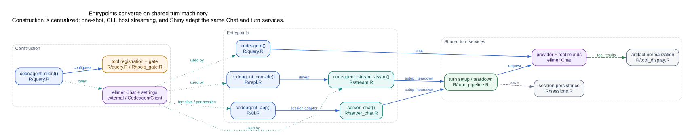

# 代码架构地图（简体中文）

**语言：**
[English](https://kaipingyang.github.io/codeagent/articles/architecture-code-map.md)
\| 简体中文

本文是维护者代码地图，不是全部 R function calls 的自动
dump。R6、S7、callback、动态工具注册和 process worker
使纯静态图既嘈杂又不完整。图使用 codegraph/LSP
作为作者取证工具，并把经过复核的 architecture edges 写入 manifest。

理解这些文件背后的运行时概念，请先看[技术概念与边界](https://kaipingyang.github.io/codeagent/articles/architecture-concepts-cn.md)。

## Edge 语义

| Edge       | 含义                       |
|------------|----------------------------|
| `calls`    | direct/shared call path    |
| `callback` | callback/event 注册或调用  |
| `state`    | 拥有、携带或共享状态       |
| `spawns`   | 创建 worker/process/daemon |
| `persists` | 写入持久状态               |
| `guards`   | 授权/安全边界              |
| `returns`  | 结果返回父路径             |

点线 ownership edge 不一定是 function call。显式区分这些
edge，避免把动态 R 架构伪装成普通静态调用图。

## 各入口汇聚到共享 turn machinery



**读者：** 维护者 / 集成者

[`codeagent_client()`](https://kaipingyang.github.io/codeagent/reference/codeagent_client.md)
集中处理 provider/model、settings、prompt、tool registration 和
permission callback。各入口把同一个 mutable Chat 适配给不同宿主：

- [`codeagent()`](https://kaipingyang.github.io/codeagent/reference/codeagent.md)：one-shot；
- [`codeagent_console()`](https://kaipingyang.github.io/codeagent/reference/codeagent_console.md)：同步stream和REPL命令；
- [`codeagent_stream_async()`](https://kaipingyang.github.io/codeagent/reference/codeagent_stream_async.md)：UI-neutral
  typed callbacks；
- [`codeagent_app()`](https://kaipingyang.github.io/codeagent/reference/codeagent_app.md)：Shiny
  shell；[`server_chat()`](https://kaipingyang.github.io/codeagent/reference/server_chat.md)
  把browser events接入共享turn services。

`turn_pipeline.R` 拥有setup/teardown，ellmer拥有provider/tool
rounds；`tool_display.R`规范tool result，session persistence单独存在。

### 入口文件

| 文件 | 主要职责 |
|----|----|
| `R/query.R` | client factory、one-shot、agent loop、tool registration |
| `R/repl.R` | terminal host和commands |
| `R/stream.R` | typed streaming host contract |
| `R/ui.R` | Shiny page/layout/session construction |
| `R/server_chat.R` | Shiny browser adapter |
| `R/turn_pipeline.R` | 共享setup/teardown |
| `R/sessions.R` | lossless state和presentation records |

## 前台 turn 周围的核心模块


**读者：** 维护者

核心 turn 有意保持较小，cross-cutting concerns 独立存在：

- **Context：** `resource.R` 做廉价large-result
  replacement；`compaction.R`负责request-boundary recount和summary。
- **Safety：**
  `input_gate.R`、`tools_gate.R`、`hooks.R`、`data_shield.R`
  保护不同边界。Permission
  gate是授权authority，hooks是扩展点，Shield负责数据保密。
- **Presentation：** `tool_display.R`拥有versioned artifact
  adapter；`web_citations.R`拥有current-turn source
  registry；`output_gate.R`负责最终可见回复安全。
- **Persistence：** `sessions.R`保存lossless turns和文本presentation
  records。

修改模块时要复核全部 edge type，而不只是direct callers。例如修改tool
result会同时影响model-facing value、artifact、optional shinychat
display、citation source extraction、Shield egress和session replay。

## Multi-agent 与 process ownership


**读者：** 维护者 / 安全审阅者

三类执行路径的保证不同：

### Foreground Agent

-同一R process内clone parent Chat；
-继承parent实际工具的allowlist/signature snapshot； -codeagent-owned
shielded clone共享同一live `DataShield`； -subagent reply在成为parent
tool result前经过output gate。

### Team workers

- [`team_run()`](https://kaipingyang.github.io/codeagent/reference/team_run.md)
  /
  [`team_coordinate()`](https://kaipingyang.github.io/codeagent/reference/team_coordinate.md)
  在mirai workers中创建fresh clients； -worker接收immutable
  security/backend snapshot，不能扩大parent authority；
- [`team_coordinate()`](https://kaipingyang.github.io/codeagent/reference/team_coordinate.md)
  用SQLite board存tasks、dependencies、messages、atomic initial
  claim和completion record；
- [`team_lead()`](https://kaipingyang.github.io/codeagent/reference/team_lead.md)在多轮team
  execution外做bounded semantic coordination。

### Background Agent

-要求可重建backend和process-safe config； -Data
Shield当前拒绝cross-process background path，不序列化live protection
engine； -unsupported launch fail closed，不静默切换provider。

用户API和当前board语义见[团队协调](https://kaipingyang.github.io/codeagent/articles/team-coordination-cn.md)。

## Change-impact 指南

| 修改… | 至少复核… |
|----|----|
| turn setup/teardown | query、stream、Shiny adapter、compaction、sessions |
| tool metadata/modes | tools gate、hooks、Shield ingress、subagent snapshots |
| tool result shape | artifact adapter、Shield egress、citations、replay、UI hosts |
| citation registry | web/provider citations、output gate、sessions |
| Data Shield | input/tool/output三边、foreground subagent、background fail-closed |
| session codec | restore、replay presentation、citations、tool IDs |
| model switch | Chat identity、tools/hooks、Shield、Shiny captured state |
| team worker setup | backend descriptor、credential selector、allowed tools、board cleanup |

## 为什么不是全自动调用图

纯静态提取会漏掉：

- ellmer `on_request_start`、`on_tool_request`、`on_tool_result`
  callbacks； -R6 mutable state ownership； -S7 content dispatch； -tool
  factories和dynamic registration； -Shiny reactive observers；
  -callr/mirai/background process boundaries； -不是function
  call的persistence/security关系。

所以canonical
manifest记录edge证据和语义。Codegraph/LSP用于发现和复核，但不是pkgdown
build dependency。

## 重新生成

``` sh
python3 tools/render_architecture_diagrams.py
node tools/render_dot_svg.mjs
python3 tools/check_architecture_diagrams.py
```

Graphviz WASM renderer固定在R package依赖之外；详见
`vignettes/diagrams/README.md`。生成的DOT/SVG和curated JSON
source都提交，因此pkgdown/offline vignette不需要Node或Graphviz。
