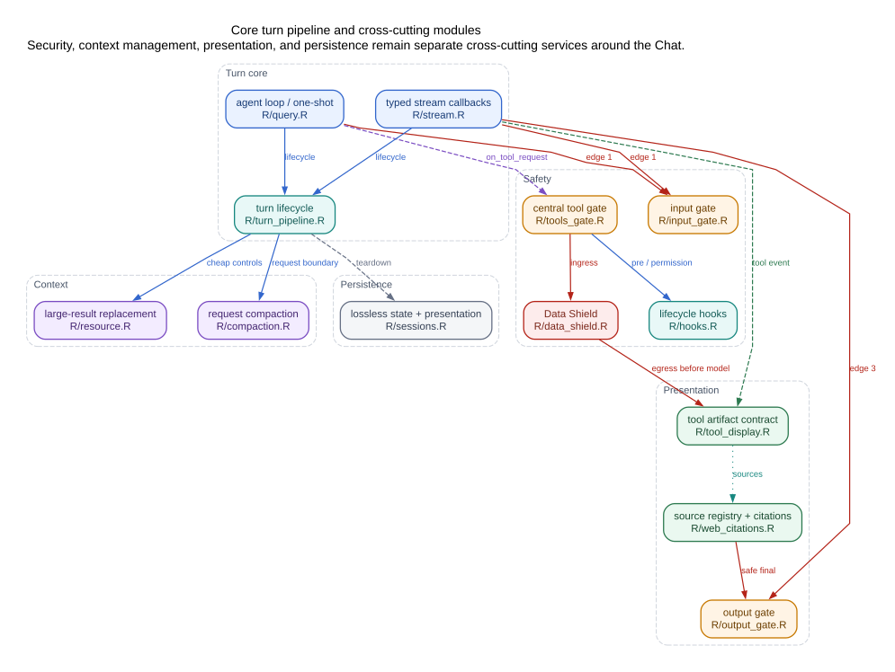
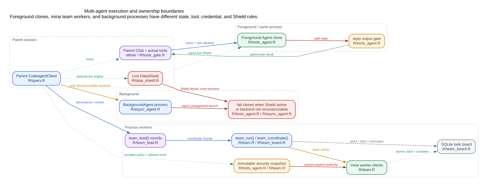

```{r, include = FALSE}
knitr::opts_chunk$set(collapse = TRUE, comment = "#>", eval = FALSE)
```

**Language:** English | [简体中文](architecture-code-map-cn.html)

This article is a maintainer map, not a generated dump of every R call. R6,
S7, callbacks, dynamic tool registration, and process workers make a fully
static graph both noisy and incomplete. The diagrams use codegraph/LSP as
authoring evidence and record a curated set of architecture edges.

For the runtime concepts behind these files, start with
[Concepts and boundaries](architecture-concepts.html).

## Edge semantics

| Edge | Meaning |
|---|---|
| `calls` | direct/shared call path |
| `callback` | callback/event registration or invocation |
| `state` | owns, carries, or shares state |
| `spawns` | creates a worker/process/daemon |
| `persists` | writes durable state |
| `guards` | authorization/security boundary |
| `returns` | result returns to a parent path |

A dotted ownership edge is not necessarily a function call. Keeping these edge
types explicit avoids pretending that dynamic R architecture is a plain static
call graph.

## Entrypoints converge on shared turn machinery


**Audience:** Maintainer / Integrator

`codeagent_client()` centralizes provider/model resolution, settings, prompt,
tool registration, and the permission callback. The entrypoints then adapt the
same mutable Chat for different hosts:

- `codeagent()` is the one-shot path.
- `codeagent_console()` drives synchronous streaming and REPL commands.
- `codeagent_stream_async()` exposes the UI-neutral callback contract.
- `codeagent_app()` creates the Shiny shell; `server_chat()` adapts browser
  events to the shared turn services.

`turn_pipeline.R` owns setup/teardown, while ellmer owns provider/tool rounds.
Tool results are normalized in `tool_display.R`; session persistence remains a
separate service.

### Entry files

| File | Primary responsibility |
|---|---|
| `R/query.R` | client factory, one-shot, agent loop, tool registration |
| `R/repl.R` | terminal host and commands |
| `R/stream.R` | typed streaming host contract |
| `R/ui.R` | Shiny page/layout/session construction |
| `R/server_chat.R` | Shiny browser adapter |
| `R/turn_pipeline.R` | shared setup/teardown |
| `R/sessions.R` | lossless state and presentation records |

## Core modules around a foreground turn



**Audience:** Maintainer

The core turn is deliberately small. Cross-cutting concerns remain separate:

- **Context:** `resource.R` performs cheap large-result replacement;
  `compaction.R` owns request-boundary recount and summaries.
- **Safety:** `input_gate.R`, `tools_gate.R`, `hooks.R`, and `data_shield.R`
  protect different boundaries. The permission gate is the authorization
  authority; hooks are extensions; Shield handles data confidentiality.
- **Presentation:** `tool_display.R` owns the versioned artifact adapter;
  `web_citations.R` owns the current-turn source registry;
  `output_gate.R` owns finalized visible response safety.
- **Persistence:** `sessions.R` stores lossless turns and text presentation
  records.

When changing one module, review every edge type, not only direct callers. For
example, changing a tool result affects the model-facing value, the artifact,
the optional shinychat display, citation source extraction, Shield egress, and
session replay.

## Multi-agent and process ownership



**Audience:** Maintainer / Security reviewer

The three execution families have different guarantees:

### Foreground Agent

- Clones the parent Chat in the same R process.
- Receives an allowlist/signature snapshot of the parent's actual tools.
- A codeagent-owned shielded clone shares the same live `DataShield` engine.
- The subagent reply is output-gated before becoming the parent tool result.

### Team workers

- `team_run()` and `team_coordinate()` create fresh clients in mirai workers.
- Workers receive an immutable security/backend snapshot and cannot expand
  authority beyond the parent snapshot.
- `team_coordinate()` uses the SQLite board for tasks, dependencies, messages,
  atomic initial claims, and completion records.
- `team_lead()` is a bounded semantic coordinator around repeated team rounds.

### Background Agent

- Requires a reconstructable backend and process-safe configuration.
- Data Shield currently rejects the cross-process background path rather than
  serializing a live protection engine.
- Unsupported launches fail closed instead of silently changing provider.

See [Team coordination](team-coordination.html) for the user-facing APIs and
current board semantics.

## Change-impact guide

| If you change... | Review at least... |
|---|---|
| turn setup/teardown | query, stream, Shiny adapter, compaction, sessions |
| tool metadata or modes | tools gate, hooks, Shield ingress, subagent snapshots |
| tool result shape | artifact adapter, Shield egress, citations, replay, UI hosts |
| citation registry | web tools/provider citations, output gate, sessions |
| Data Shield | input/tool/output edges, foreground subagent, background fail-closed path |
| session codec | restore, replay presentation, citations, tool IDs |
| model switch | Chat identity, tools/hooks, Shield, Shiny captured state |
| team worker setup | backend descriptor, credentials selector, allowed tools, board cleanup |

## Why the graph is curated

Static call extraction alone misses:

- ellmer `on_request_start`, `on_tool_request`, and `on_tool_result` callbacks;
- R6 mutable state ownership;
- S7 content dispatch;
- tool factories and dynamic registration;
- Shiny reactive observers;
- callr/mirai/background process boundaries;
- persistence and security relationships that are not function calls.

The canonical manifest therefore records edge evidence and meaning. Codegraph
and LSP help discover and verify edges, but they are not pkgdown build
dependencies.

## Regenerating the maps

```sh
python3 tools/render_architecture_diagrams.py
node tools/render_dot_svg.mjs
python3 tools/check_architecture_diagrams.py
```

The Graphviz WASM renderer is pinned outside the R package dependency graph; see
`vignettes/diagrams/README.md`. Generated DOT/SVG and their curated JSON source
are all committed so pkgdown and offline vignettes do not need Node or Graphviz.
