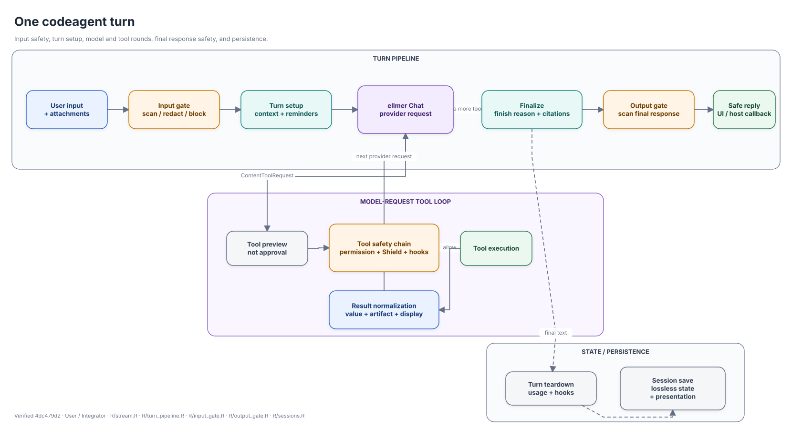
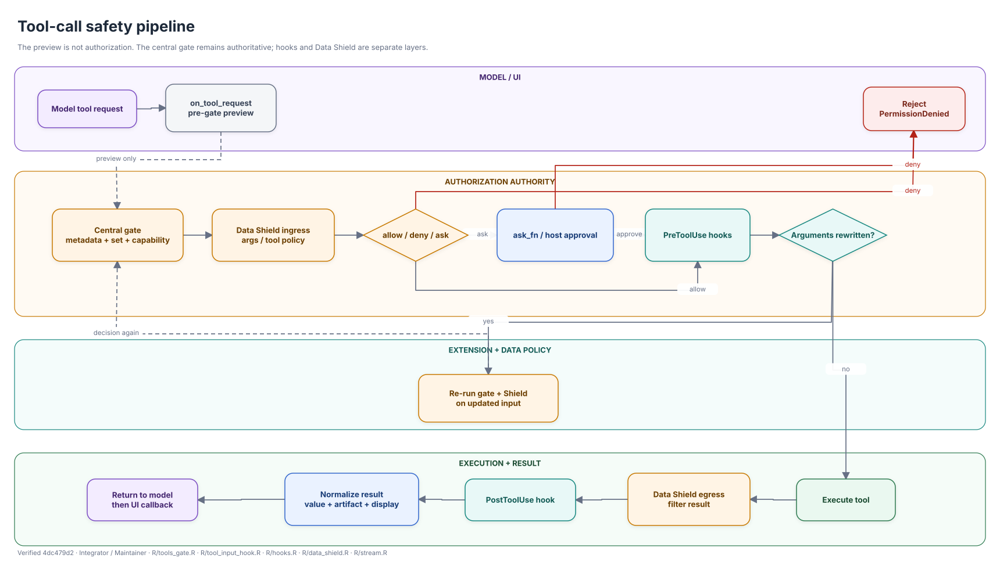
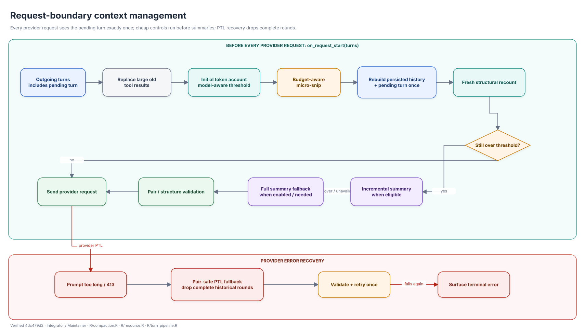

```{r, purl=FALSE, include = FALSE}
knitr::opts_chunk$set(collapse = TRUE, comment = "#>", eval = FALSE)
```

**语言：** [English](architecture-concepts.html) | 简体中文

本文是 codeagent 的技术概念地图，解释一轮交互的顺序、授权与扩展机制的分工，以及每次
provider request 前的上下文生命周期。文件和函数级结构见
[代码架构地图](architecture-code-map-cn.html)。

图中有意不写高频变化的数量、模型名和 token 阈值；精确默认值仍以专题文章和 API 文档为准。

## 视觉语言

| 视觉 | 含义 |
|---|---|
| 蓝色 | 用户、宿主、入口或可移植结果 |
| 紫色 | 模型/provider 工作或模型摘要 |
| 琥珀/红色 | 策略、授权、拒绝或错误恢复 |
| 绿色 | 执行或安全/已验证结果 |
| 青色/灰色 | 生命周期、上下文、内部状态或持久化 |
| 实线 | 主调用/数据路径 |
| 虚线/点线 | callback、状态或持久化关系 |

## 一次前台 Agent turn

<div class="architecture-diagram mb-4">
<div class="d-flex justify-content-end mb-2">
<a class="btn btn-outline-primary btn-sm" href="diagrams/svg/agent-turn-lifecycle.drawio.svg" target="_blank" rel="noopener noreferrer" aria-label="在新标签页中全尺寸打开Agent turn 生命周期图">全尺寸查看 ↗</a>
</div>
<a class="architecture-diagram-link d-block" href="diagrams/svg/agent-turn-lifecycle.drawio.svg" target="_blank" rel="noopener noreferrer" aria-label="在新标签页中全尺寸打开Agent turn 生命周期图">

</a>
</div>

**读者：** 用户 / 集成者
**源码：** `R/stream.R`、`R/turn_pipeline.R`、`R/input_gate.R`、
`R/output_gate.R`、`R/sessions.R`

一轮交互有五个稳定阶段：

1. **输入边界。** 用户文本和含文本附件先过 input gate；Data Shield 可以 redact、ask 或 block。
2. **Turn setup。** Harness 注入动态上下文/reminder，管理资源，并准备 request-boundary compaction。
3. **Provider/tool rounds。** ellmer 驱动一个或多个 provider request。Tool request 必须经过下方安全链，执行后把 normalized result 送回下一次 provider request。
4. **最终回复边界。** 先确定 finish reason 和 deterministic citations，再进入 output gate。Shield/citation 模式在服务端 buffer；raw provider delta 不会先到浏览器。
5. **Teardown/persistence。** 运行 usage/lifecycle hooks，然后保存 provider-facing lossless state 和 presentation view。

图以 `codeagent_stream_async()` 为主，但 one-shot、REPL 和 Shiny adapters 复用相同边界。Adapter 拥有 presentation，Chat/turn services 拥有模型和工具状态。

### 一轮交互的不变量

- Tool preview 不是 approval。
-被拒绝的 tool 不会通过另一个 UI entrypoint 绕过 central gate。
-Shield/citation buffering 必须发生在服务端，而不是数据已发浏览器后再隐藏。
- Session presentation 可以被脱敏，而 lossless provider-facing state 另行保留；at-rest policy 是独立安全问题。

继续阅读：

- [权限系统](permissions-cn.html)
- [数据盾](data-shield-cn.html)
- [后端集成](backend-integration-cn.html)
- [工具工件](tool-artifacts-cn.html)

## 工具调用安全链

<div class="architecture-diagram mb-4">
<div class="d-flex justify-content-end mb-2">
<a class="btn btn-outline-primary btn-sm" href="diagrams/svg/tool-safety-pipeline.drawio.svg" target="_blank" rel="noopener noreferrer" aria-label="在新标签页中全尺寸打开工具安全链路图">全尺寸查看 ↗</a>
</div>
<a class="architecture-diagram-link d-block" href="diagrams/svg/tool-safety-pipeline.drawio.svg" target="_blank" rel="noopener noreferrer" aria-label="在新标签页中全尺寸打开工具安全链路图">

</a>
</div>

**读者：** 集成者 / 维护者
**源码：** `R/tools_gate.R`、`R/tool_input_hook.R`、`R/hooks.R`、
`R/data_shield.R`、`R/stream.R`

三个职责相邻，但必须保持独立：

1. **Permission 是授权 authority。** Central gate 解释 tool metadata、enabled sets、capability policy、per-tool overrides、mode 和 rules。`ask` 由宿主 `ask_fn` 解决；无 callback 默认 deny。
2. **Hooks 是扩展点。** `PreToolUse` 可以 deny 或 rewrite arguments。改参后必须重新经过 permission 和 Shield；`PostToolUse` 位于结果路径之后。
3. **Data Shield 保护模型边界。** Ingress 在执行前检查参数，egress 在结果回灌模型前过滤。Shield bypass 永远不能绕过独立权限门。

`codeagent_stream_async(on_tool_request=)` 只是 UI 使用的 **pre-gate preview**，不能据此生成 approval decision 或标记 execution started。真正审批由
`install_permission_gate(..., ask_fn=)` 驱动，并使用同一 tool-call id 关联。

结果被规范成三条通道：

```text
value      模型/UI可移植文本后备
artifact   有版本、UI-neutral的结构化数据
display    可选的shinychat adapter
```

非 shinychat 宿主读取 artifact，并在不支持时回退 value；不要解析 display HTML。

## Request-boundary 上下文管理

<div class="architecture-diagram mb-4">
<div class="d-flex justify-content-end mb-2">
<a class="btn btn-outline-primary btn-sm" href="diagrams/svg/context-compaction-lifecycle.drawio.svg" target="_blank" rel="noopener noreferrer" aria-label="在新标签页中全尺寸打开上下文压缩生命周期图">全尺寸查看 ↗</a>
</div>
<a class="architecture-diagram-link d-block" href="diagrams/svg/context-compaction-lifecycle.drawio.svg" target="_blank" rel="noopener noreferrer" aria-label="在新标签页中全尺寸打开上下文压缩生命周期图">

</a>
</div>

**读者：** 集成者 / 维护者
**源码：** `R/compaction.R`、`R/resource.R`、`R/turn_pipeline.R`

当前 compaction 挂在 ellmer `on_request_start`，所以在**每个 provider request** 前运行，包括 tool loop 内部轮次。Callback 收到的 outgoing turns 已包含 pending turn。

顺序是设计不变量：

1.替换符合条件的大型历史 tool results；
2.执行 model-aware 初始 accounting；
3.先做廉价、预算感知的 micro-snip；
4.重建 persisted history，并把原始 pending turn **只追加一次**；
5.对重建结构 fresh recount，不能继续用旧 provider usage 当 mutation 后下界；
6.仍超限时才尝试 incremental summary，再进入可选 full-summary fallback；
7. provider request 前验证 tool request/result pairing。

若 provider 仍返回 prompt-too-long/413，recovery 会删除完整历史 API rounds，重新验证并只重试一次；不会删除半个 tool request/result pair。

阈值、开关和错误语义见[上下文压缩](compaction-cn.html)。

## 状态与所有权边界

| 状态 | Owner | 共享规则 |
|---|---|---|
| Provider/model 配置 | ellmer Chat | 只通过验证过的clone/rebuild路径复制 |
| Tool set + permission callback | Chat / host | subagent只能缩窄父Chat实际工具 |
| Turn lifecycle | harness | one-shot/stream/REPL/Shiny共用 |
| Data Shield engine | client/session | codeagent-owned前台clone可共享同一live engine |
| Browser UI state | host adapter | 不能作为授权来源 |
| Session JSONL | codeagent session store | 同时含lossless state与presentation records |
| Process worker state | worker process | 接收immutable security snapshot，不共享parent mutable state |

这也是 codeagent 不注册 `shinychat::chat_server()` 的原因：即使视觉组件属于 shinychat，streaming、permission、hooks、Data Shield 和 persistence 仍必须由 codeagent 单一拥有。

## 详细文章导航

| 问题 | 文章 |
|---|---|
| 权限门如何决策？ | [权限系统](permissions-cn.html) |
| 三条模型边界如何保护？ | [数据盾](data-shield-cn.html) |
| 上下文如何压缩？ | [上下文压缩](compaction-cn.html) |
| 子代理和团队有何区别？ | [团队协调](team-coordination-cn.html) |
| 其他UI如何把codeagent作为后端？ | [后端集成](backend-integration-cn.html) |
| UI如何消费工具结果？ | [工具工件](tool-artifacts-cn.html) |
| 技能如何发现和加载？ | [技能](skills-usage-cn.html) |

## 图的维护方式

可编辑 draw.io 源位于 `vignettes/diagrams/src/`，生成 SVG 位于
`vignettes/diagrams/svg/`。每张图记录 primary source files 和 verified commit。渲染和校验命令见 `vignettes/diagrams/README.md`。
