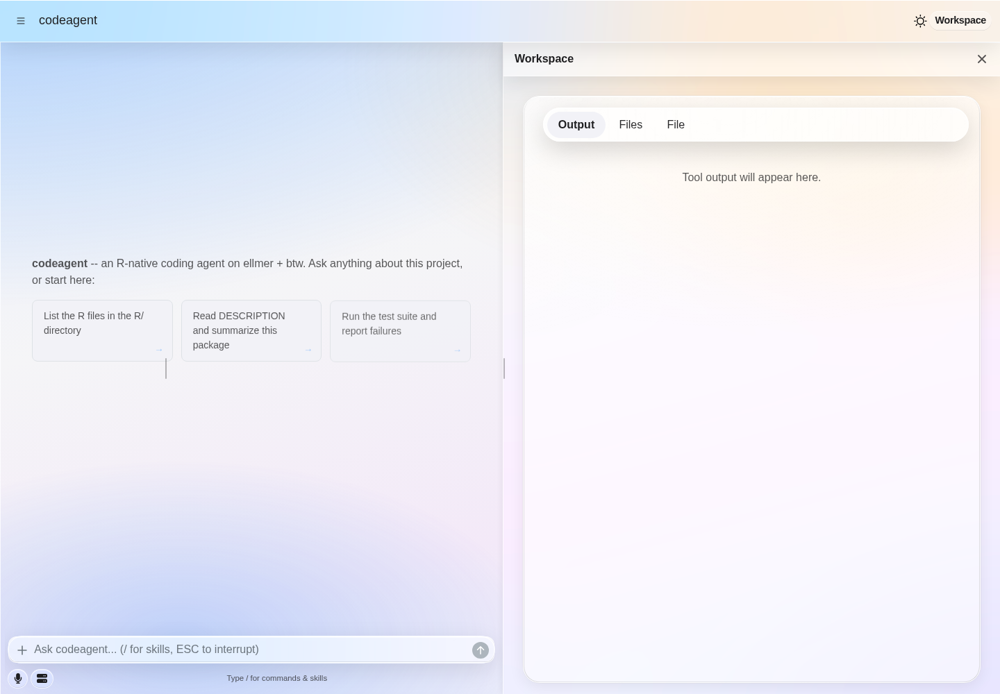
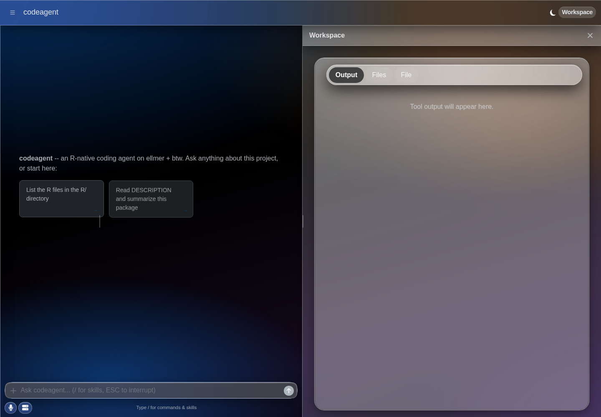

```{r, purl=FALSE, include=FALSE}
knitr::opts_chunk$set(
  collapse = TRUE,
  comment = "#>",
  eval = FALSE
)
```

**Language:** English | [简体中文](shiny-themes-cn.html)

`codeagent_app()` supports both its classic embedded-chat layout and shinychat's
full-window `page_chat` layout. Built-in themes use the same bslib foundation in
both layouts; the screenshots below show the `page_chat` layout, where the
sidebar, global toolbar, chat canvas, composer, and Workspace drawer are all
visible.

## Liquid Glass

The optional `glass` theme delegates its material rendering, live intensity,
tint, specular highlights, and accessibility fallbacks to
[shinyglass](https://ericrayanderson.github.io/shinyglass/). codeagent adds only
a thin adapter for shinychat's header, sidebar, drawer, and composer surfaces.

### Light mode



*Liquid Glass in light mode, with the Workspace drawer open.*

### Dark mode



*The same app after switching the bslib color-mode control to dark mode.*

Both screenshots were captured at 1440 x 1000 in real Chromium with
`intensity = 0.45` and `tint = FALSE`. The dark-mode control updates bslib and
shinyglass together at runtime.

Install the exact shinyglass build verified by codeagent, then create the theme:

```r
pak::pak(
  "ericrayanderson/shinyglass@e07c0ae7b9cdf7959eace05c7ac32481f06d5a7c"
)

liquid_theme <- codeagent_theme(
  "glass",
  preset = "auto",
  intensity = 0.45,
  tint = FALSE,
  specular = TRUE
)

codeagent_app(
  client,
  ui_layout = "page_chat",
  theme = liquid_theme
)
```

Use shinyglass's public runtime controls when a host application needs to adjust
the material dynamically. For example, `window.shinyglass.setIntensity(0.8)`
increases both opacity and blur without replacing the codeagent theme.

## Other built-in themes

The remaining built-ins do not require shinyglass:

| Theme | Appearance |
|---|---|
| `default` | The standard shinychat/bslib page theme |
| `ios` | Grouped canvas, bright cards, and compact iOS-like surfaces |
| `aurora` | Ambient blue-indigo-purple lighting with selective frosted chrome |
| `flatly` | Light Bootswatch theme |
| `darkly` | Dark Bootswatch theme |

Pass a name directly to `codeagent_app()` or build a reusable theme object:

```r
codeagent_app(client, ui_layout = "page_chat", theme = "aurora")

ios_theme <- codeagent_theme(
  "ios",
  primary = "#0057d9",
  `shiny-chat-page-canvas-bg` = "#ffffff"
)
codeagent_app(client, ui_layout = "page_chat", theme = ios_theme)
```

Arbitrary bslib and `shinychat::page_chat_theme()` objects also pass through
unchanged. To preview a built-in without configuring a model request, run:

```bash
Rscript inst/examples/run_theme_preview.R --list
Rscript inst/examples/run_theme_preview.R glass page_chat
```
