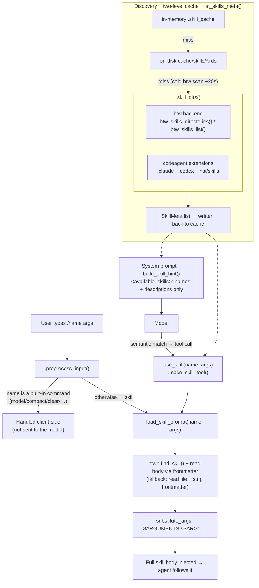

```{r, purl=FALSE, include = FALSE}
knitr::opts_chunk$set(collapse = TRUE, comment = "#>", eval = FALSE)
```

## What are skills?

Skills are reusable prompt templates that the agent can invoke on demand.
Type `/skillname` in the chat to activate a skill, or the agent will
auto-trigger matching skills based on your request.

## Built-in skills

codeagent ships with skills for common R package development tasks:

| Skill | Description |
|-------|-------------|
| `/plan` | Read-only planning mode — analysis + step-by-step plan |
| `/verify` | Structured verification of the last action (correctness, completeness) |
| `/simplify` | Review and simplify the last code/output |
| `/compact` | Manually trigger context compaction |
| `/remember` | Save information to persistent cross-session memory |
| `/loop` | Run a skill/task periodically (e.g. `/loop 5m /verify`) |
| `/document` | Run `devtools::document()` (rebuild `NAMESPACE` + `man/`) |
| `/roxygen` | Generate a roxygen2 documentation skeleton |
| `/testthat` | Write testthat unit tests |
| `/style` | Format + lint to a consistent style (styler / lintr / air) |
| `/lint` | Lint and style R code with lintr and styler |
| `/news` | Update `NEWS.md` for a release |
| `/pkgdown` | Build or update a pkgdown website |
| `/explore` | Explore and analyse a data.frame in natural language |
| `/report` | Export the exploration session to a Quarto document |
| `/no-secrets` | Guardrail: never commit or print secrets |
| `/posit-dev-packages` | Update ellmer/btw/shinychat to latest dev versions |

(The live list is always available via `list_skills_meta()` or by typing `/` in
the chat for the slash-command typeahead.)

## Using skills from the chat

```
# In the Shiny app or REPL:
/plan add a new summarise_by_group() function
/roxygen summarise_by_group
/testthat summarise_by_group
```

## Creating custom skills

Skills are `name/SKILL.md` directories. codeagent uses **btw** as the discovery
backend, so the search paths are btw's directories plus a couple of
compatibility paths. Put custom skills in any of:

```
# User-global (btw native):
~/.btw/skills/my-skill/SKILL.md
~/.config/btw/skills/my-skill/SKILL.md

# Project-local:
.btw/skills/my-skill/SKILL.md          # btw native
.agents/skills/my-skill/SKILL.md       # btw agents dir
.claude/skills/my-skill/SKILL.md       # Claude Code compat
.codex/skills/my-skill/SKILL.md        # Codex compat
```

**SKILL.md format**:

```markdown
---
name: my-skill
description: Short description shown in skill picker
argument-hint: "<what to type after /my-skill>"
allowed-tools:
  - Read
  - Bash
---

Skill body — instructions for the agent.

Use $ARGUMENTS to insert the user-supplied arguments.
```

## Architecture / flow

codeagent uses **btw** as the discovery and loading backend, and wraps it with
a two-level cache, extra compatibility paths (`.claude/`, `.codex/`), two
invocation paths, and progressive disclosure (only skill *names + descriptions*
go into the system prompt; the full body is loaded on demand).



The cache signature is `count + sum(mtime)` of every `SKILL.md`, so it
self-invalidates whenever a skill is added, removed, or edited.

## Skill discovery

```{r, purl=FALSE, purl=FALSE}
# List all available skills
list_skills_meta()

# Load a skill prompt programmatically
load_skill_prompt("plan", args = "add feature X", cwd = getwd())
```
